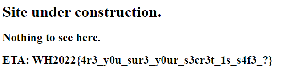

# OSINT/Bad Historial Design
Author: Hartanto
Difficulty: Easy
Description: 
So, Lewis used to say to me that he had a website. I doubt there is anything there, but let's check it out.

We are given the following link:
Site Link: https://lewischan0601.github.io

Opening the site, we see the following: 


We notice that the site is hosted on github.io, meaning that it is a Github Pages Site. Exploring further, we find Lewis's Github Pages Site Repository with an Interesting Commit History (see https://github.com/lewischan0601/lewischan0601.github.io/commits/main)

Loooking further, we see a hint in one of the commits:


This also reminds us of the Challenge Title, Bad Historical Design. Using Wayback Machine (https://web.archive.org/web/20220112010617/https://lewischan0601.github.io/), we get the flag: 


Flag: ```WH2022{4r3_y0u_sur3_y0ur_s3cr3t_1s_s4f3_?}```
