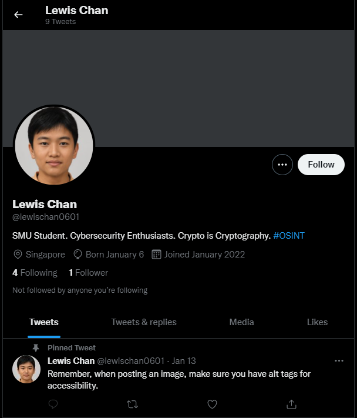
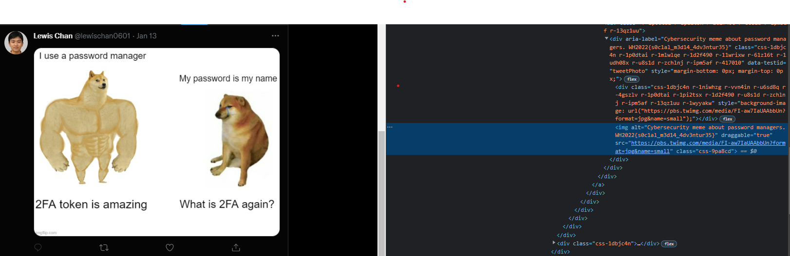

# OSINT/Beginning of a Journey
Author: Hartanto
Difficulty: Easy
Description:
Welcome to OSINT! The challenges in this category will enable you to learn more about OSINT, and reflect on your internet activity traces.
Here's your first challenge. One of our friends, Lewis, is a Computer Science student at SMU School of Computing and Information Systems who is majoring in cybersecurity. Unfortunately, we haven't heard from him in a couple of weeks.
Let's see if we can find something on his Twitter account. Not really sure what is his username though. But I do recall his full name is Lewis Chan and that his birthday is on the 6th of January. Oh, and he really hates cryptocurrency. I think he said that it is a Ponzi scheme or something.
Note: Making any contact with any individuals is out of the scope of this challenge. You wouldn't want to alert someone that you're investigating them right?

Searching on Twitter, we find the following account: https://twitter.com/lewischan0601 

We also see that he has pinned a tweet which looks important:



Using that hint and toggling over to the "Media Tab", we see the following image with an interesting-looking alt text, giving us our flag:



Flag: ```WH2022{s0c1al_m3d14_4dv3ntur35}```