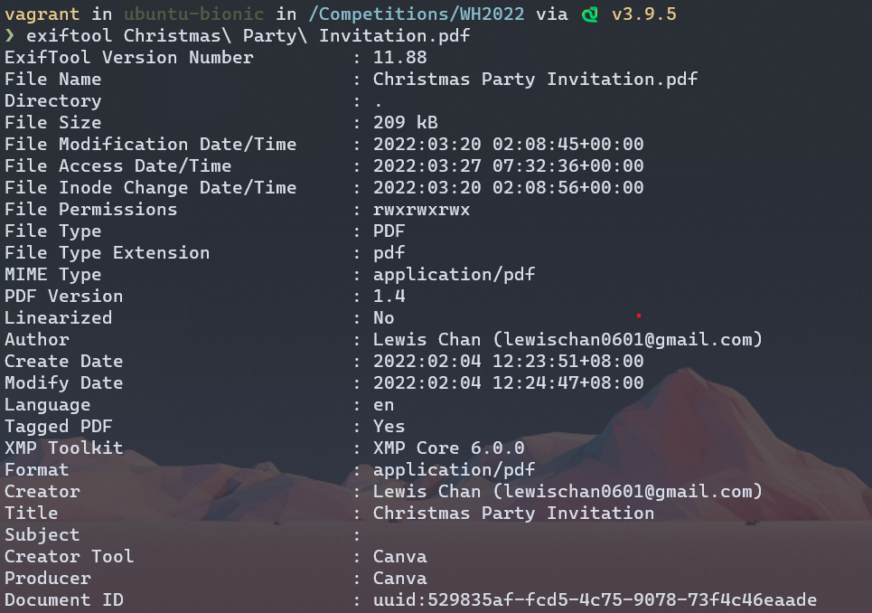
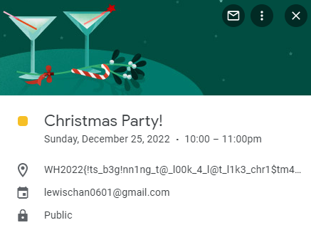

# OSINT/This Christmas
Author: Hartanto
Difficulty: Medium
Description:
So, Lewis had this habit of inviting people to next year's Christmas party at the start of every year. However, this year he didn't provide us with any information. All he provides us is this card. Maybe there's something there?

We are provied a PDF that looks like this: 


Running exiftool on the pdf, we get the following result:



The email looks promising: lewischan0601@gmail.com 
We also note that the date on the invite is 25th December 2022

Adding his calendar to calendar.google.com, and scrolling to 25th December 2022, we see the following and get the flag:
 


Flag: ```WH2022{!ts_b3g!nn1ng_t@_l00k_4_l@t_l1k3_chr1$tm4s}```
